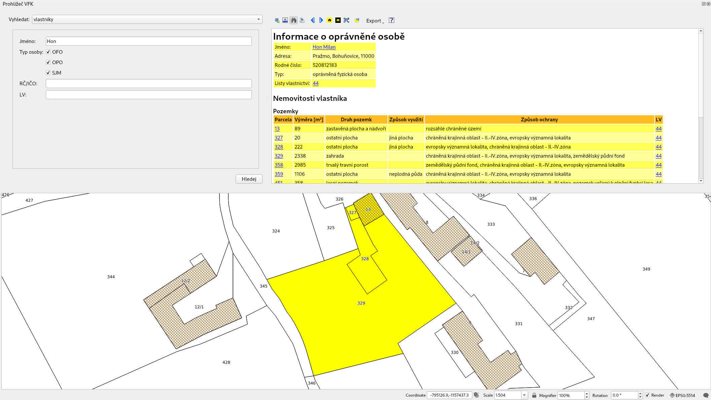

Zásuvný modul QGIS pro práci s katastrálními daty ve formátu VFK
================================================================

QGIS VFK Plugin pracuje s daty českého katastru nemovitostí a to v takzvaném **výměnném formátu katastru** označovaném **VFK** (`Výměnný formát KN <https://www.cuzk.cz/Katastr-nemovitosti/Poskytovani-udaju-z-KN/Vymenny-format-KN.aspx>`__). 
Plugin umožňuje vyhledávání, zobrazování a export informací vedených v 
katastru nemovitostí. 

           
.. toctree::
   :maxdepth: 2

   popis
   dodatek
