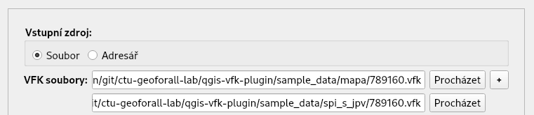
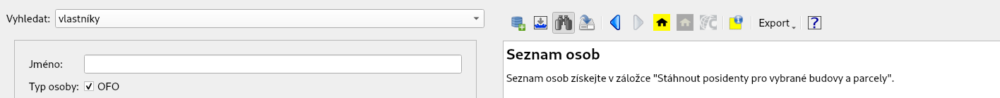
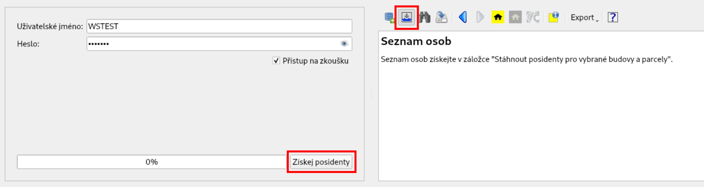
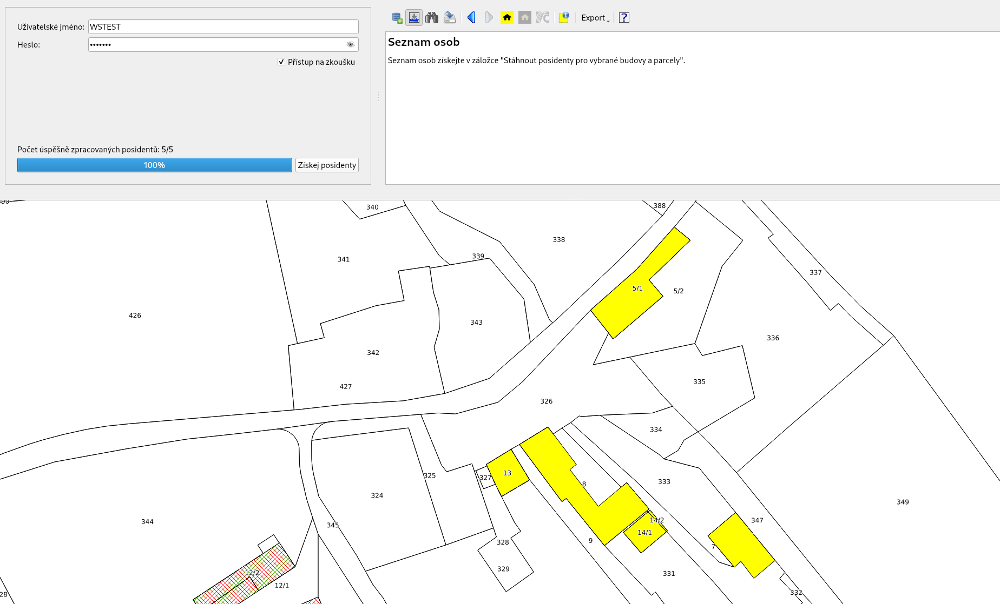
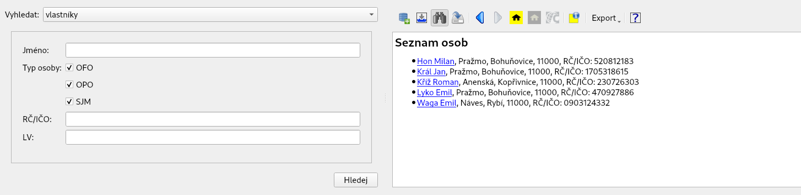

Návod k použití
---------------

Uživatelské rozhraní
====================

.. image:: images/vfk.png

Import VFK souboru
==================

Při importu dat nejdříve vyberte soubor ve formátu VFK a následně
zaškrtněte vrstvy, které chcete importovat - ve výchozím nastaveni jde
o *Parcely* (PAR) a *Budovy* (BUD). Můžete zvolit obě, jednu z nich nebo
žádnou. Pokud nezaškrtnete žádnou, načtou se pouze popisná data. Bude
tedy možné vyhledávat informace, ale nebude možná interakce s
mapou. Nakonec klikněte na tlačítko ``Načíst``.

.. image:: images/vfk_import.png

Rozhraní umožňuje načíst více VFK souborů najednou, případně všechny
VFK soubory ze zvoleného adresáře.

.. note::

   Pokud načítáte více VFK souborů najednou, tak platí omezení na
   jedno katastrální území. Zásuvný modul v současné době neumožňuje
   pracovat s daty pokrývající více než jedno katastrální území.
   
Prohlížení dat
==============

V panelu nástrojů stiskněte ikonu vyhledávání (dalekohled). V levé části 
prohlížeče VFK vyberte v rozbalovacím menu, co chcete vyhledat - vlastníky,
parcely, budovy nebo jednotky. Po výběru možnosti, zadejte parametry vyhledávání
a klikněte na tlačítko ``Hledej``. Můžete zadat jeden, ale i více parametrů 
vyhledávání. Vyhledané informace se zobrazí v pravém okně prohlížeče VFK.

.. figure:: images/vfk_info.png
      
.. tip:: Pokud nezadáte žádný parametr vyhledávání, jsou vyhledány všechny 
   nemovitosti či osoby obsažené v databázi.

Prohlížeč VFK funguje obdobně jako webové prohlížeče. Kliknutím na odkaz se 
zobrazí informace o stavbě, parcele, oprávněných osobách nebo list vlastnicví.
Stejně jako ve webovém prohlížeči se ukládá historie stránek, je tedy možné 
listovat tam a zpět, a proto není třeba opakovaně vykonávat dotazy do databáze.

.. figure:: images/vfk_link.png

.. figure:: images/vfk_link_info.png
  
Pokud chcete zobrazit vyhledaná data v mapovém okně, klikněte na ikonu ``Označit 
aktuální budovy/parcely v mapě`` v panelu nástrojů.

.. figure:: images/vfk_map.png
 
Zásuvný modul umožňuje také otevření aplikace Nahlížení do katastru nemovitostí ve 
webovém prohlížeči pro aktuálně zobrazovanou nemovitost. Je zavolán ten webový 
prohlížeč, který máte nastavený jako výchozí ve vašem operačním systému.

.. figure:: images/vfk_cuzk.png

.. figure:: images/cuzk.png

Získaní informací o vlastnících
^^^^^^^^^^^^^^^^^^^^^^^^^^^^^^^

Soubory VFK neobsahují informace o vlastnicích (oprávněných subjektech).

Tyto informace lze získat pomocí služby `ČÚZK WSDP
<https://www.cuzk.cz/Aplikace-DP-do-KN/Aplikace-DP-do-KN/Webove-sluzby-dalkoveho-pristupu.aspx>`__. Pro
tento účel si nejprve `zřiďte
<https://www.cuzk.cz/Katastr-nemovitosti/Poskytovani-udaju-z-KN/Dalkovy-pristup/Zrizeni-uctu-dalkoveho-pristupu.aspx>`__
uživatelský účet. V panelu nástrojů stiskněte ikonku ``Stáhnout
posidenty pro vybrané budovy a parcely`` a vyplňte přihlašovací údaje.

Vyberte v mapovém okně budovy nebo parcely, pro které si přejete tyto
informace získat a stiskněte tlačítko ``Získej posidenty``.

.. note::

   Zásuvný modul používá pro získání posidentů knihovnu
   `PyWSDP <https://ctu-geoforall-lab.github.io/pywsdp/>`__.

Po přepnutí do panelu vyhledávání jsou informace o vlastnících již
dostupné.

Export dat
==========

Momentálně je možný export dat do formátů LaTeX (možno následně
vytvořit PDF) a HTML (možno následně vytvořit ODF např. překopírováním
HTML stránky z webového prohlížeče do `LibreOffice
<https://www.libreoffice.org/>`__).

.. figure:: images/vfk_export.png
